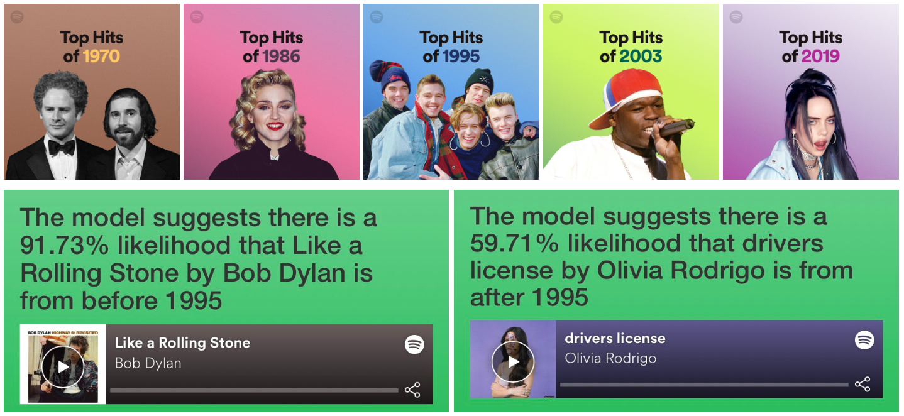

# Spotify, Machine Learning and Shiny

**A workflow that gathers data from the Spotify API, creates a simple Logistic Regression model, and then produces a Shiny app to display results of predictions.**

A Machine Learning model trained on ~5,000 hit songs recorded between 1970 and 2019. The aim was to classify songs as being from either before or after the mid-point year of 1995. The model uses metrics available from Spotify's API - including tempo, duration, 'valence', 'acousticness', etc. - to make predictions. Songs that were part of the original training and test sets are exlcuded from the results.

You can see how accurately the model is able to predict the relative age of songs by entering a song's Spotify link into the box below. In the Spotify interface, click on the three dots to the right of a song title, then Share, and finally on Copy Link. You can then paste that link into the field below.

Once you've entered a link, click 'Run Prediction'. The model will make a guess and provide an indication of how likely that prediction is to be 'correct'. Most of the time the model is pretty accurate (although it does of course have a randon 50/50 chance of being correct!). In testing, it achieved ~85% accuracy but tended to struggle most with songs recorded in years immediately either side of 1995 and with songs that exemplify certain genres (e.g. jazz, country).

The contents of the repo are as follows:

**1 - Get Spotify Playlist Data**

Retrieves data on ~5,000 songs from the Spotify API. These songs are taken from Spotify's in-house 'Top Hits of {YEAR}' playlists for the years 1970 to 2019.

**2 - Clean Data**

Performs some basic tidying and cleaning of the data set generated in step 1.

**3 - EDA**

A number of exploratory visualsations, looking for the appearance of any linear trends in Spotify metrics over time.

**4 - Build Logistic Regression Model**

Using the TidyModels package, a basic Logstics Regression model is trained on a subset of the data gathered above.

**6 - Evaluate Model**

Explore ROC and other metrics to see how well (or otherwise!) the model performs.

**6 - Create Predictions**

Generate predictions on live data using the model produced in step 4.

**7 - Shiny App Prototype**

Build a local version of a Shiny app that enables users to use the model via an interface.

**8 - Shiny App**

Style the app, split out functions into separate scripts, add descriptive text.

